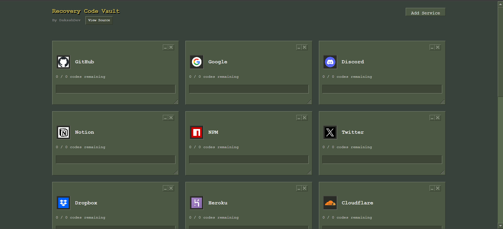

#  Simple Recovery Code Vault

A secure, client-side app for managing recovery codes with AES-256 encryption. Features a nostalgic Green Steam (vgui.css) aesthetic.


The Dashboard User Interface

## Features
- **AES-256 Encryption** – Codes are encrypted locally (localstorage lol no server)
- **Zero Server** – Everything stays on your machine
- **Auto-Import** – Drag & drop `.txt` files to import codes (these .txt files are provided by the service you use example- Github)
- **Usage Tracking** – Mark codes as used and monitor remaining codes.

## Quick Start
```bash
git clone https://github.com/DaksshDev/RecoveryCodesVault.git
cd RecoveryCodesVault
npm install
npm run dev
```

Open [http://localhost:5173](http://localhost:5173)

## Tech Stack
React • Vite • Zustand • CryptoJS • Tailwind css • [Vgui.css](https://github.com/AlpyneDreams/vgui.css)

## Styling
Uses greensteam css styles `./client/public/vgui/styles` using [vgui.css](https://github.com/AlpyneDreams/vgui.css).

---
*Secure. Simple. Local.*

**Thanks to [VGUI CSS](https://github.com/AlpyneDreams/vgui.css) for the cool retro ui styling (the repo is cloned at client/public/vgui)**